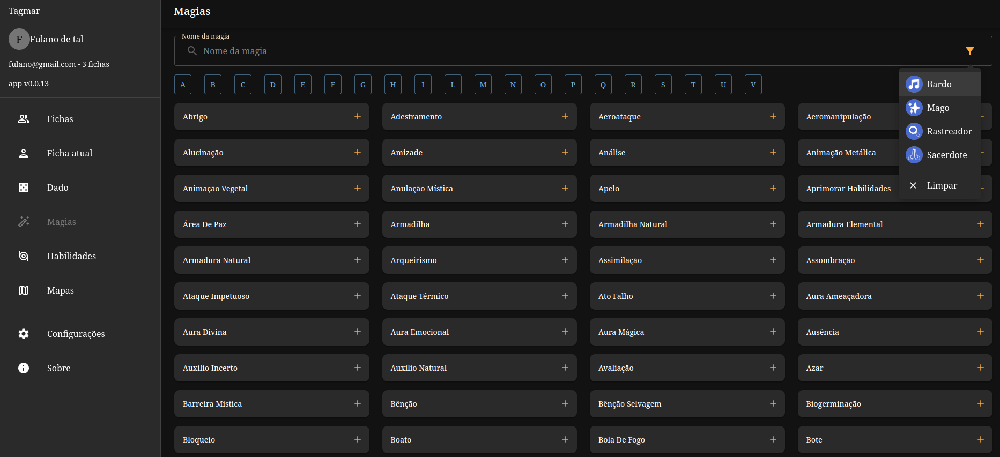
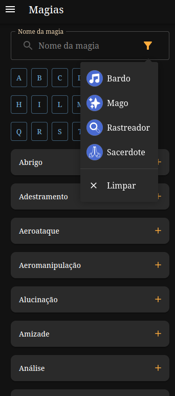

# Tagmar App

App Tagmar versão WEB

## O que é Tagmar?

É um RPG brasileiro. [Aqui](https://www.tagmar.com.br/) você pode encontrar mais informações.

A licença atual do projeto é somente para o código-fonte. Tagmar tem uma [licença própria](https://www.tagmar.com.br/LicenciamentoUsado.aspx).

## Por que mais um aplicativo?

Se já existe um [aplicativo](https://play.google.com/store/apps/details?id=br.com.tagmar) bem completo, porque criar outro?

A ideia não é derrubar/ganhar/fazer melhor. Minha ideia é fazer diferente. O outro é muito bom, mas eu quero as coisas feitas de outra forma, outro leiaute...

Além disso, fazendo versão web torna o aplicativo mais abrangente: Android, iOS, Linux, Windows... E sendo PWA, fica com cara de aplicativo nativo. Para atualizar basta entrar na internet que tudo se atualiza.

### Exemplo

24/03/204

## Ferramentas

- Yarn
- React.js
- Vite
- Typescript
- ...

### Como rodar localmente

1. Baixe o projeto
2. > yarn
3. > make start

## Imagens

Ainda sem imagens. Estou provando conceitos ;)

## Agradecimentos

- Todos que criam e jogam Tagmar
- [PWA](https://dev.to/bhendi/turn-your-react-vite-app-into-a-pwa-3lpg)
- [PWA](https://dev.to/iamfranco/deploy-react-vite-pwa-to-github-pages-35i)
- [PWA](https://adueck.github.io/blog/caching-everything-for-totally-offline-pwa-vite-react/)
- [Github pages](https://dev.to/github/how-to-use-github-pages-to-host-your-website-even-with-multiple-repos-27k2)
- [PWA asset generator](https://www.npmjs.com/package/pwa-asset-generator)
- [Manifest generator](https://www.simicart.com/manifest-generator.html/)
- [Bubblewrap](https://chromeos.dev/en/publish/pwa-in-play)
- [Jaro Winkler](https://www.geeksforgeeks.org/jaro-and-jaro-winkler-similarity)

## Roadmap

- [ ] Revisar a tela de fichas
  - [x] Mover o botão de adicionar para um menu
  - [ ] Fazer os cards funcionarem
    - [x] Favorito
    - [X] Apagar
    - [ ] Editar
  - [ ] Criar tela de ficha
    - [ ] Criar
      - [ ] Abas
    - [ ] Ver
    - [ ] Gastar XP
    - [ ] Imprimir pdf no layout do livro
- [ ] Dado
  - [ ] adicionar seleção de coluna
  - [ ] exibir o resultado
  - [ ] cor por tipo de lançamento (quando lançar usando a ficha)
- [ ] Magias
  - [x] completar a lista
  - [x] organizar layout
  - [ ] revisar [descrição](https://www.tagmar.com.br/wiki/Default.aspx?PageName=Livro%20de%20Magias)
- [ ] Habilidades (atualmente em revisão oficial do RPG, então ficará parado por um tempo)
  - [ ] fazer
- [ ] Mapas
  - [ ] Exibir um mapa grande
  - [ ] O mapa deve ser selecionável (svg) por região
  - [ ] Popup com descrição
- [X] Configurações
  - [x] Ativar/desativar dado 3d
  - [x] Ativar/desativar busca por nome aproximado
- [ ] Sobre (sempre revisando)
  - [x] Colaboradores
- [ ] Outros
  - [ ] Persistir
    - [x] Configurações
    - [ ] Fichas
    - [ ] [Google](https://blog.logrocket.com/guide-adding-google-login-react-app/)
      - [ ] [Login](https://www.npmjs.com/package/%40react-oauth/google)
      - [ ] [Salvar](https://www.perplexity.ai/search/possvel-usar-o-6Dxp2R2ERHCO8_EhI6mnWQ)
  - [ ] Salvar no sistema de arquivos
    - [ ] exportar
    - [ ] importar
